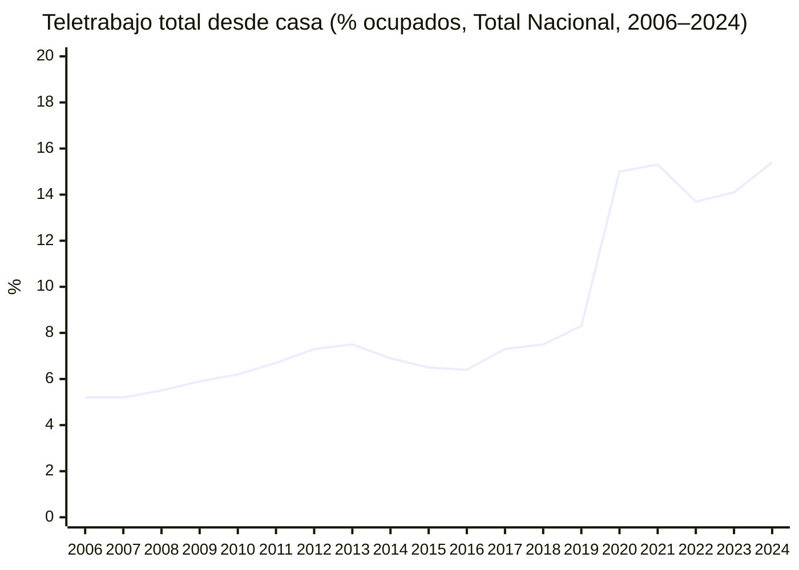
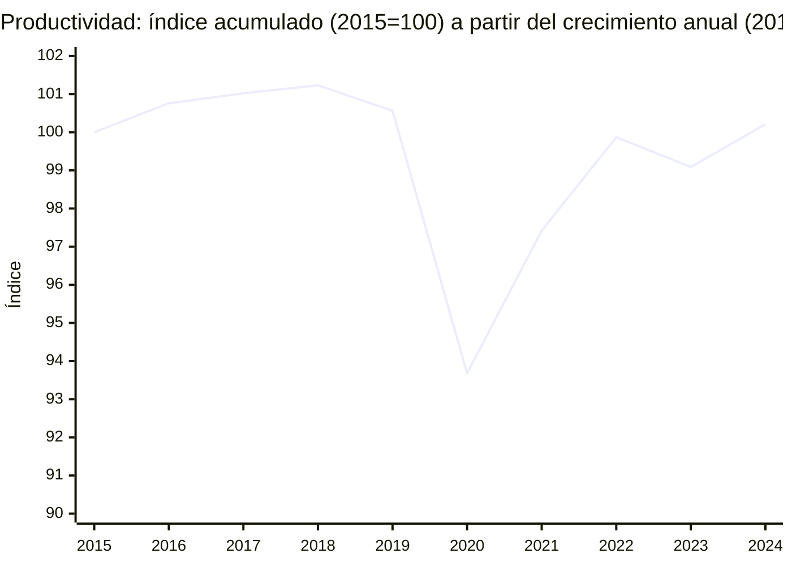
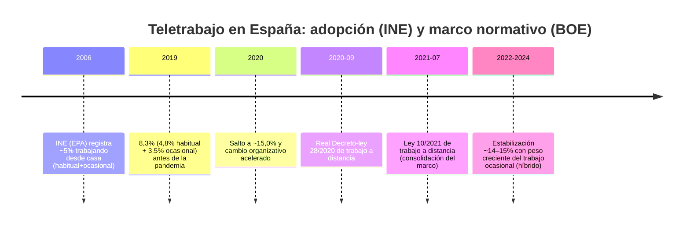

# chatgpt:

Investigación completa sobre el impacto del teletrabajo en la productividad laboral en España

## Resumen ejecutivo

El término **“investigación completa”** es ambiguo y el **tema no fue especificado**. Para responder a la solicitud de forma útil y demostrativa, asumo explícitamente un **tema por defecto** y lo aplico como ejemplo de investigación rigurosa: **impacto del teletrabajo en la productividad laboral en España** (enfoque 2015–2024 para comparabilidad con indicadores de productividad y 2006–2024 para adopción del teletrabajo).

La evidencia **descriptiva** de fuentes oficiales del **Instituto Nacional de Estadística (INE)** muestra un **cambio estructural** en la adopción del teletrabajo (medido como “trabajar en el domicilio particular”): en el total nacional, el porcentaje de ocupados que trabajó desde casa **al menos ocasionalmente** pasó de niveles de un dígito antes de la pandemia a estabilizarse alrededor del **entorno del 14–15%** en los últimos años disponibles (2006–2024). Estos resultados se basan en la tabla abierta de la **EPA** con cobertura 2006–2024 (Identificador API 65776). citeturn42view0turn43view0turn25search11

En paralelo, un indicador oficial de **crecimiento anual de la productividad** (Contabilidad Regional de España; Total Nacional; 2015–2024) refleja una dinámica fuertemente marcada por la pandemia: caída significativa en 2020 y recuperación posterior, de modo que un índice acumulado con base 2015≈100 vuelve cerca del nivel inicial hacia 2024 (con oscilaciones interanuales). citeturn47view0

A nivel **macroeconómico**, con estos dos instrumentos oficiales (teletrabajo y crecimiento de productividad), no es metodológicamente correcto inferir causalidad: el gran “salto” de teletrabajo en 2020 coincide con un shock económico sistémico, y la productividad está afectada por múltiples factores (demanda, composición sectorial, inversión, capital humano, competencia, tamaño empresarial, calidad de gestión, etc.). La literatura y análisis institucionales en español subrayan que el binomio **teletrabajo–productividad es contingente**: puede ser positivo o negativo según tareas, intensidad, calidad de la gestión y el diseño híbrido. citeturn25search10turn25search28turn0search35

En términos normativos, España dispone desde 2020–2021 de un marco que no es neutral para la productividad: exige **formalización** del acuerdo, contempla **dotación/compensación de gastos**, regula **reversibilidad** y refuerza derechos como la **desconexión digital**, aspectos relevantes para sostenibilidad y desempeño. citeturn30view0turn29view0

## Contexto, objetivos y preguntas de investigación

### Contexto y definiciones operativas

**Supuesto de medición principal (teletrabajo):** en esta investigación aplicada uso la serie oficial de la **EPA** publicada por el INE como “**ocupados por frecuencia con la que trabajan en su domicilio particular**”, que distingue, entre otros, “**ocasionalmente**” y “**más de la mitad de los días**”. En el informe, denomino:

- **Teletrabajo habitual** ≈ *más de la mitad de los días trabajados en el domicilio particular*.
- **Teletrabajo ocasional** ≈ *ocasionalmente en el domicilio particular*.
- **Teletrabajo total** ≈ suma de habitual + ocasional (esto aproxima un concepto de trabajo remoto desde casa, no necesariamente el universo completo de “trabajo a distancia” si se realiza fuera del domicilio). citeturn42view0turn43view0turn25search11

**Supuesto de medición principal (productividad):** por disponibilidad y trazabilidad oficial, uso “**tasa de crecimiento anual de la productividad**” (Total Nacional) dentro de la Contabilidad Regional de España (2015–2024) y construyo un **índice acumulado (base 2015=100)** con esa tasa. Esto es un **proxy macro**, no una medida directa del efecto del teletrabajo a nivel empresa/puesto. citeturn47view0

### Objetivos

El objetivo general es **diseñar un flujo de investigación completo** y aplicarlo al caso del teletrabajo en España para responder con rigor a:

- **Cómo ha evolucionado** la adopción del teletrabajo (desde casa) y qué patrón tiene (habitual vs ocasional).
- **Qué ha pasado** con la productividad (según un indicador oficial) en el mismo horizonte temporal.
- **Qué mecanismos** propone la literatura sobre cómo el teletrabajo puede afectar la productividad y por qué los resultados empíricos suelen ser heterogéneos.
- **Qué implicaciones prácticas** se derivan para empresas y políticas públicas dentro del marco legal vigente.

### Preguntas de investigación

1. ¿Cuál es la trayectoria 2006–2024 del teletrabajo desde casa en el total nacional y cómo cambió tras 2020? citeturn42view0turn43view0
2. ¿Cómo evoluciona 2015–2024 el indicador oficial de crecimiento anual de la productividad y qué lectura permite (y cuál no) sobre teletrabajo? citeturn47view0
3. ¿Qué condiciones (tareas, gestión, tecnología, intensidad híbrida, regulación) median el impacto del teletrabajo sobre productividad? citeturn25search10turn25search28turn0search35
4. ¿Qué recomendaciones accionables se pueden justificar para empresas y para el regulador/administraciones, considerando el marco de trabajo a distancia en España? citeturn29view0turn30view0

## Metodología de investigación

### Diseño general

Se aplica un enfoque mixto de **revisión de alcance (scoping review)** y **análisis descriptivo** con datos oficiales:

- **Revisión**: identificar debates, mecanismos, brechas y consenso razonable.
- **Cuantitativo descriptivo**: series temporales oficiales para adopción del teletrabajo y evolución de productividad; análisis exploratorio (no causal).

### Búsqueda bibliográfica y bases consultadas

Se consultaron fuentes oficiales y repositorios en español, complementadas con instituciones internacionales:

- Portales y normativa: **BOE** (leyes y texto consolidado), y documentación asociada al **Ministerio de Trabajo y Economía Social** cuando aplica vía servicios/organismos públicos. citeturn29view0turn30view0
- Estadística oficial: **INE** (EPA y Contabilidad Regional; acceso vía portal y API/descargas), y catálogo de datos públicos (datos.gob.es) para enlaces reproducibles de descarga. citeturn42view0turn47view0turn41search14
- Repositorios y literatura en español: **Dialnet** para artículos en español sobre teletrabajo y productividad. citeturn25search10turn25search6
- Organismos internacionales: **Eurostat** como referencia comparada en medición de trabajo desde casa y acceso por APIs; **OCDE** como referencia en definiciones e indicadores de productividad; y análisis divulgativo-económico de **FMI** en español para síntesis de mecanismos. citeturn24search7turn23search0turn2search27turn25search28

### Estrategia de búsqueda y términos

Se utilizaron combinaciones en español e inglés, por ejemplo:

- “teletrabajo productividad España”, “trabajo a distancia Ley 10/2021”, “EPA trabaja en domicilio particular”, “tasa crecimiento productividad INE”, “remote work productivity evidence”, “working from home productivity mechanisms”. (Búsqueda web realizada el 20/03/2026.)

### Criterios de inclusión y exclusión

**Inclusión**:

- Fuentes oficiales (INE, BOE, repositorios públicos).
- Artículos o informes con argumentación sobre productividad y teletrabajo (mecanismos, evidencia empírica, medición).
- Cobertura temporal relevante (preferencia 2015–2026; para adopción del teletrabajo, series largas cuando existan).

**Exclusión**:

- Opinión sin sustento metodológico cuando no aporte marco conceptual claro.
- Estudios no transferibles al contexto (p. ej., sin relación con mercados laborales comparables) salvo como contraste explícito.

### Transparencia y reproducibilidad

Se priorizaron series con descarga directa y API. El INE publica una referencia de API y, en datos.gob.es, enlaces estables a CSV/JSON para cada tabla (identificador API). citeturn41search14turn42view0turn47view0

## Evidencia cuantitativa en España

### Evolución del teletrabajo desde casa

La tabla oficial de la EPA (Identificador API 65776; Total Nacional; Ambos sexos) permite reconstruir 2006–2024 y observar tres hechos robustos:

- **Antes de 2020**: crecimiento lento, pasando de **~5–8%** (teletrabajo total) en 2006–2019.
- **2020–2021**: salto a **~15%** del total de ocupados trabajando desde casa al menos ocasionalmente.
- **2022–2024**: estabilización en torno a **~14–15%**, con un **giro hacia lo ocasional** (modelo híbrido) frente a lo “más de la mitad de los días”. citeturn42view0turn43view0turn25search11

A modo de validación conceptual, el INE ya destacaba antes de la pandemia (2019) una tendencia moderada al alza: 4,8% “normalmente” y 3,5% “ocasionalmente”. citeturn25search11

**Gráfico de adopción (teletrabajo total = habitual + ocasional, % ocupados, Total Nacional, 2006–2024).** Fuente: INE (EPA, tabla 65776). citeturn42view0turn43view0



### Dinámica habitual vs ocasional y lectura organizativa

El cambio de composición tras la pandemia es clave para productividad:

- 2020: predominio del componente **habitual** (>½ de días) frente al ocasional.
- 2024: prácticamente **equilibrio** entre habitual y ocasional, compatible con la expansión de esquemas **híbridos**. citeturn42view0turn43view0

Esto importa porque el híbrido tiende a combinar ganancias de concentración individual con necesidades de coordinación/presencialidad (la literatura discute que el efecto neto depende del diseño). citeturn25search10turn25search28

### Productividad: crecimiento anual y un índice acumulado sencillo

La Contabilidad Regional publica “tasa de crecimiento anual de la productividad” (Total Nacional) con cobertura 2015–2024 (Identificador API 45600). citeturn47view0

Para visualizar tendencia, construyo un índice acumulado (base 2015=100) mediante:
**Índice(t) = Índice(t–1) × (1 + crecimiento(t)/100)**.
Esto no identifica el efecto del teletrabajo, pero sí sitúa el debate en el ciclo macro.

**Gráfico (índice acumulado de productividad, base 2015=100; Total Nacional, 2015–2024).** Fuente: INE (tabla 45600). citeturn47view0



### Tabla de comparación anual

La tabla siguiente alinea (i) teletrabajo desde casa y (ii) crecimiento de productividad (proxy macro), para evitar comparaciones “a ojo” y hacer explícita la ruptura 2020.

| Año | Teletrabajo habitual (%) | Teletrabajo ocasional (%) | Teletrabajo total (%) | Crecimiento anual productividad (%) | Índice productividad (2015=100) |
| ---: | -----------------------: | ------------------------: | --------------------: | ----------------------------------: | -------------------------------: |
| 2015 |                      3,6 |                       2,9 |                   6,5 |                                1,14 |                           100,00 |
| 2016 |                      3,5 |                       2,9 |                   6,4 |                                0,76 |                           100,76 |
| 2017 |                      4,3 |                       3,0 |                   7,3 |                                0,26 |                           101,02 |
| 2018 |                      4,3 |                       3,2 |                   7,5 |                                0,21 |                           101,23 |
| 2019 |                      4,8 |                       3,5 |                   8,3 |                              −0,67 |                           100,56 |
| 2020 |                     10,8 |                       4,2 |                  15,0 |                              −6,84 |                            93,68 |
| 2021 |                      9,4 |                       5,9 |                  15,3 |                                4,00 |                            97,42 |
| 2022 |                      7,5 |                       6,2 |                  13,7 |                                2,51 |                            99,87 |
| 2023 |                      7,1 |                       7,0 |                  14,1 |                              −0,78 |                            99,09 |
| 2024 |                      7,8 |                       7,6 |                  15,4 |                                1,13 |                           100,21 |

Fuentes: teletrabajo (INE, EPA; Identificador API 65776) y productividad (INE, Contabilidad Regional; Identificador API 45600). citeturn42view0turn43view0turn47view0

### Línea temporal de adopción y regulación

La cronología es importante porque el teletrabajo no evoluciona “solo por tecnología”: también lo hace por shocks (COVID-19) y por marco regulatorio (trabajo a distancia).

- La serie de teletrabajo desde casa (INE) cubre 2006–2024 y muestra un salto en 2020 y estabilización posterior. citeturn42view0turn43view0
- En 2020 se aprueba un marco específico (Real Decreto-ley 28/2020) y en 2021 se consolida vía Ley 10/2021, que regula acuerdo, gastos, reversibilidad y desconexión digital, entre otros. citeturn30view0turn29view0



(Series INE y normativa en BOE). citeturn42view0turn43view0turn30view0turn29view0

## Revisión de literatura y síntesis crítica

### Hallazgos clave

En conjunto, la literatura en español e institucional converge en que el efecto del teletrabajo sobre productividad es **heterogéneo**:

- Puede aumentar la productividad en tareas con alta necesidad de concentración y baja dependencia de coordinación sincrónica, pero puede reducirla si se deterioran colaboración, aprendizaje informal, innovación o cohesión (especialmente con teletrabajo extremo o mal diseñado). citeturn25search10turn25search28
- Depende de “complementos”: calidad de gestión, claridad de objetivos, digitalización, ergonomía y condiciones del hogar, cultura de confianza y capacidad de coordinación (especialmente relevante en esquemas híbridos). citeturn25search28turn0search35
- A nivel país, la relación teletrabajo–productividad puede quedar dominada por shocks y composición sectorial; por eso, el análisis causal suele requerir microdatos (empresa/puesto) o diseños cuasi-experimentales. citeturn25search10turn24search7

### Debates y brechas

Persisten debates metodológicos relevantes:

- **Medición**: “trabajar desde casa” no equivale siempre a “teletrabajo” regulado; además, intensidad (días) no captura calidad (infraestructura, interrupciones, seguridad de la información). citeturn42view0turn29view0
- **Sesgo de selección**: quienes teletrabajan suelen concentrarse en ocupaciones/sectores con mayor contenido digital; comparar productividad media sin controlar composición puede inducir conclusiones erróneas. citeturn0search35turn25search10
- **Horizonte temporal**: puede haber ganancias de corto plazo y pérdidas (o ganancias) de largo plazo vía innovación, rotación, formación o capital organizativo (tema todavía en consolidación). citeturn25search28turn25search10

### Tabla comparativa de estudios y fuentes en español

La tabla resume fuentes relevantes (oficiales y analíticas) útiles para una investigación completa; no todas son “papers académicos” en sentido estricto, pero aportan piezas complementarias (medición, contexto macro, hipótesis de mecanismos).

| Fuente/estudio                                                                                              | Enfoque y metodología                                                                              | Muestra/datos                                                            | Resultados relevantes sobre productividad                                                               | Limitaciones principales                                               |
| ----------------------------------------------------------------------------------------------------------- | --------------------------------------------------------------------------------------------------- | ------------------------------------------------------------------------ | ------------------------------------------------------------------------------------------------------- | ---------------------------------------------------------------------- |
| INE (EPA) – Ocupados por frecuencia de trabajo en domicilio (API 65776) citeturn42view0turn43view0 | Estadística oficial; variable de submuestra; desagrega por frecuencia (ocasional, >½ días, etc.) | España (Total Nacional y CCAA), 2006–2024                              | Permite cuantificar adopción y cambio de composición (híbrido vs habitual)                           | No mide productividad; “domicilio” no cubre todo trabajo a distancia |
| INE – Crecimiento anual de productividad (API 45600) citeturn47view0                                 | Contabilidad regional; indicador anual                                                              | Total Nacional, 2015–2024                                               | Ubica el debate en ciclo macro; permite índice acumulado                                               | No identifica efecto del teletrabajo; indicador agregado y multicausal |
| Banco de España – “El teletrabajo en España” citeturn0search35                                   | Análisis institucional (documento/boletín) sobre extensión y condicionantes del teletrabajo      | Evidencia española (incluye referencias a EPA y estructura ocupacional) | Enfatiza determinantes (tareas, digitalización) y límites prácticos                                  | Parte de evidencia inicial; no es un experimento causal                |
| CaixaBank Research – “Teletrabajo y productividad: un binomio complejo” citeturn25search10         | Nota analítica/divulgativa con discusión de mecanismos                                            | Síntesis de literatura                                                  | Argumenta que el impacto depende de organización, tareas e intensidad                                  | No aporta estimación causal propia; depende de literatura secundaria  |
| FMI (Bloom) – “El teletrabajo impulsa la productividad” (artículo en español) citeturn25search28 | Ensayo de síntesis sobre evolución y mecanismos                                                   | Evidencia internacional resumida                                         | Defiende potencial de productividad y estabilización del teletrabajo por encima de niveles prepandemia | Generalista; no específico de España; no sustituye análisis micro   |
| Dialnet – Araya (2020) “Teletrabajo y su impacto en productividad…” citeturn25search6             | Revisión de literatura sobre productividad y satisfacción                                         | Literatura, múltiples contextos                                         | Identifica factores de éxito (gestión, recursos, diseño)                                             | Contexto no español; heterogeneidad alta                              |

## Resultados, discusión y recomendaciones

### Resultados integrados

1) **El teletrabajo (desde casa) se duplicó estructuralmente** respecto al periodo pre-COVID: promedio 2015–2019 ≈ **7,2%** vs promedio 2022–2024 ≈ **14,4%** (Total Nacional, habitual+ocasional). citeturn42view0turn43view0
2) **El componente híbrido crece**: tras el pico de teletrabajo habitual en 2020, la composición se desplaza hacia lo ocasional, coherente con esquemas mixtos. citeturn42view0turn43view0
3) **La productividad agregada 2015–2024** (según el indicador disponible) presenta una trayectoria dominada por el shock 2020 y recuperación posterior, por lo que **no puede atribuirse** el cambio a teletrabajo sin un diseño causal. citeturn47view0
4) El marco legal español de trabajo a distancia establece condiciones organizativas que afectan la productividad **indirectamente**: formalización, medios, gastos, reversibilidad, desconexión digital y derechos colectivos, entre otros. citeturn29view0turn30view0

### Discusión: por qué el agregado no responde por sí solo

Con datos agregados, incluso si se calcula correlación simple entre teletrabajo y productividad, los resultados son **poco interpretables** porque:

- 2020 combina aumento abrupto del teletrabajo con caída macroeconómica y cambios de composición sectorial. citeturn42view0turn47view0
- La productividad depende de inversión, tamaño empresarial, calidad de gestión y reasignación entre empresas; la **OCDE** insiste en palancas como el escalado empresarial para elevar productividad, lo que puede ser más determinante que el régimen de lugar de trabajo por sí solo. citeturn2search29turn2search27

### Recomendaciones prácticas para empresas

Estas recomendaciones buscan ser operativas y compatibles con el marco normativo:

- **Diseñar híbrido por tareas (no por costumbre)**: asignar presencialidad a trabajo que requiere coordinación compleja, mentoría o creatividad; reservar remoto para bloques de trabajo profundo y tareas “individualizables”. La evidencia en español enfatiza que el binomio es “complejo” y dependiente del diseño. citeturn25search10turn25search28
- **Gestión por resultados y calidad de proceso**: definir OKR/KPI, acuerdos de disponibilidad y canales de coordinación; evitar “microvigilancia” que degrada rendimiento y bienestar. El marco legal exige que el acuerdo incluya, por ejemplo, horario y medios de control, así como procedimientos ante incidencias técnicas. citeturn29view0
- **Invertir en infraestructura y ciberseguridad**: equipos, conectividad, soporte; la norma contempla inventario de medios y dotación/mantenimiento; operacionalizarlo reduce fricción y riesgo. citeturn29view0
- **Asegurar desconexión digital**: políticas internas y formación para prevenir fatiga y asegurar sostenibilidad del desempeño; la ley reconoce explícitamente el derecho a la desconexión digital para trabajo a distancia. citeturn29view0
- **Medición de productividad con enfoque mixto**: combinar métricas cuantitativas (tiempo de ciclo, calidad, cumplimiento) con evaluación cualitativa (aprendizaje, innovación). Esto es coherente con la literatura que subraya que la productividad no es solo “output inmediato”. citeturn25search10turn25search28

### Recomendaciones para políticas públicas

- **Mejorar la capacidad de evaluación causal**: habilitar (con garantías de privacidad) el enlace de microdatos de empleo/empresa para estudiar productividad, rotación, absentismo y desigualdad por intensidad de teletrabajo. La estadística actual mide bien “adopción”, pero no identifica impactos causales. citeturn42view0turn47view0
- **Políticas de digitalización y capital humano**, especialmente para pymes: el teletrabajo productivo requiere competencias digitales y procesos. Los diagnósticos de productividad de la OCDE ponen énfasis en factores estructurales (capacidad de crecimiento, reasignación, etc.). citeturn2search29turn2search27
- **Claridad regulatoria y apoyo a cumplimiento**: desarrollar guías prácticas y herramientas (modelos de acuerdo, criterios de compensación de gastos, prevención de riesgos) que reduzcan costes de transacción para empresas y trabajadores dentro del marco Ley 10/2021. citeturn29view0turn30view0
- **Seguimiento estadístico compatible y comparable**: mantener series estables (“backcasting” cuando cambian bases) para evaluar políticas a largo plazo; el propio INE documenta accesos por API y catálogos de descargas para favorecer reproducibilidad. citeturn41search14turn42view0

## Limitaciones, futuras líneas y fuentes

### Limitaciones del análisis presentado

- **Tema asumido**: el usuario no especificó tema; este informe es un ejemplo completo aplicado a un caso plausible (teletrabajo–productividad en España).
- **Productividad como proxy agregado**: el indicador usado (crecimiento anual de productividad, Total Nacional) no permite atribución causal al teletrabajo. citeturn47view0
- **Teletrabajo medido como “trabajo en domicilio”**: puede infrarrepresentar trabajo a distancia realizado fuera del hogar. citeturn42view0turn29view0
- **Ausencia de diseño causal**: sin microdatos enlazados o estrategias cuasi-experimentales, cualquier “impacto” debe interpretarse como hipótesis y no como estimación.

### Propuestas de investigación futura

- **Modelos econométricos con microdatos**: usar microdatos (EPA y/o otras encuestas empresariales) para estimar efectos controlando ocupación, sector, tamaño, capital humano, y diferencias regionales; idealmente con shocks plausiblemente exógenos o políticas “piloto”.
- **Panel empresa–trabajador**: medir productividad objetiva (ventas/valor añadido por hora, calidad, errores) y contrastarla con productividad autopercibida y bienestar.
- **Evaluación del marco legal**: estudiar si la formalización del acuerdo, la compensación de gastos y la desconexión digital se asocian con mejores resultados (rotación, absentismo, litigiosidad, desempeño). citeturn29view0turn30view0
- **Comparación UE** con definiciones armonizadas: Eurostat ofrece instrumentos de comparación internacional y APIs para extracción sistemática de series. citeturn24search7turn23search0

### Fuentes utilizadas y recomendadas

**Fuentes oficiales (prioridad alta)**

- **entity["organization","Instituto Nacional de Estadística","spain official statistics"]**: dataset EPA (teletrabajo desde casa, Identificador API 65776) y dataset de crecimiento anual de productividad (Identificador API 45600). citeturn42view0turn43view0turn47view0
- **Boletín Oficial del Estado (BOE)**: Ley 10/2021 de trabajo a distancia y Real Decreto-ley 28/2020. citeturn29view0turn30view0
- **entity["organization","Organización para la Cooperación y el Desarrollo Económicos","intergovernmental organization"]**: indicadores y diagnósticos de productividad y reformas estructurales (referencias metodológicas y de contexto). citeturn2search27turn2search29
- **entity["organization","Oficina Estadística de la Unión Europea","european union statistics office"]**: guía y acceso a datos por APIs para comparativas internacionales. citeturn24search7turn23search0

**Artículos y análisis en español (apoyo conceptual)**

- Banco de España (documento sobre teletrabajo en España). citeturn0search35
- CaixaBank Research (teletrabajo y productividad como relación contingente). citeturn25search10
- FMI (artículo divulgativo en español sobre teletrabajo y productividad). citeturn25search28
- Dialnet (revisión de literatura sobre teletrabajo, productividad y satisfacción). citeturn25search6

**Nota de obtención de datos**: Las series usadas son públicas y descargables; el INE documenta el acceso mediante API y proporciona enlaces directos de descarga a CSV/JSON desde el catálogo de datos abiertos, lo que permite replicar y auditar resultados. citeturn41search14turn42view0turn47view0

claude:


# Verificación integral de la guía ETABS v19 para Edificio 1 — NCh433/DS61

**El hallazgo más crítico: los parámetros sísmicos del Suelo C contienen un error de base.** La guía utiliza n=1.33 y p=1.50, que corresponden al **Suelo tipo B** según la Tabla 6.3 del refundido NCh433+DS61. Los valores correctos para Suelo C son  **n=1.40, p=1.60** . Este error afecta todo el espectro de diseño, el corte basal y, por ende, todas las fuerzas de diseño. Además, se identificó un error en el Cardinal Point de las vigas invertidas (el punto 8 es Top Center, no Bottom Center) y se confirmaron 10 de los 12 aspectos consultados. Las preguntas P1, P2, P5, P6 y P7 requieren los planos arquitectónicos y estructurales del proyecto, que son documentos internos del taller no accesibles por investigación externa.

---

## 1. CORRECCIONES CRÍTICAS A LA GUÍA

### 1.1 Error en parámetros de Suelo C (GRAVEDAD: ALTA)

La Tabla 6.3 del NCh433.Of1996 Mod.2012 (refundido con DS61), confirmada en el documento oficial del Ministerio de Vivienda y Urbanismo y en la presentación de Pedro Hidalgo Oyanedel (WorleyParsons/DOP, julio 2012), establece:

| Suelo       | S              | To (s)         | T' (s)         | n              | p             |
| ----------- | -------------- | -------------- | -------------- | -------------- | ------------- |
| A           | 0.90           | 0.15           | 0.20           | 1.00           | 2.0           |
| **B** | 1.00           | 0.30           | 0.35           | **1.33** | **1.5** |
| **C** | **1.05** | **0.40** | **0.45** | **1.40** | **1.6** |
| D           | 1.20           | 0.75           | 0.85           | 1.80           | 1.0           |
| E           | 1.30           | 1.20           | 1.35           | 1.80           | 1.0           |

**Corrección:** Cambiar n=1.33→**1.40** y p=1.50→**1.60** en toda la guía. Los valores originales (n=1.33, p=1.50) corresponden al Suelo B, no al Suelo C. El Suelo C fue un tipo **nuevo** introducido por el DS61 con parámetros interpolados entre los antiguos Suelos II y III. Los parámetros S=1.05, To=0.40 y T'=0.45 sí están correctos.

### 1.2 Error en Cardinal Point de vigas invertidas (GRAVEDAD: MEDIA)

La guía indica "Cardinal Point = Bottom Center (punto 8)". Esto contiene  **dos errores** :

* **Punto 8 = Top Center** (no Bottom Center). La numeración CSI es: 1=Bottom-Left, 2=Bottom-Center, 3=Bottom-Right, ..., 7=Top-Left,  **8=Top-Center** , 9=Top-Right, 10=Centroide.
* Para vigas invertidas (VI) que se dibujan a nivel de piso y se proyectan hacia arriba, el punto correcto es  **Bottom Center = Punto 2** .

**Corrección:** Cambiar a "Cardinal Point = Bottom Center ( **punto 2** )" en toda la guía. Ruta: `Assign > Frame > Insertion Point > Cardinal Point > Bottom Center`.

### 1.3 Fórmula del espectro α(T) — verificación necesaria

Múltiples fuentes chilenas presentan la fórmula con variaciones en el denominador. El análisis de consistencia con los gráficos oficiales del MOP/DOP indica que la fórmula correcta utiliza AMBOS parámetros n y p de la Tabla 6.3:

**α(Tn) = (1 + 4.5·(To/Tn)^p) / (1 + (Tn/To)^n)** para Tn > T'

**α = α(T')** para Tn ≤ T' (meseta constante)

Donde p es el exponente del numerador y n es el exponente del denominador. Esta formulación es la única que: (a) utiliza ambos parámetros de la Tabla 6.3, (b) reproduce los gráficos oficiales de espectro publicados por el MOP, y (c) produce la forma espectral físicamente correcta con decaimiento apropiado a períodos largos. Algunas fuentes secundarias muestran (To/Tn)^3 en el denominador, lo cual es inconsistente con los gráficos oficiales. **Se recomienda verificar con el profesor Music la fórmula exacta utilizada en el curso.**

---

## 2. PREGUNTAS RESUELTAS (P1–P12)

### P1, P2, P5, P6, P7: Geometría específica del edificio

Estas preguntas requieren los  **planos arquitectónicos y estructurales del Edificio 1** , que son documentos internos del taller ADSE-UCN. No es posible resolverlas mediante investigación externa. Se recomienda:

* **P1 (muros):** Revisar los planos de planta estructural y crear una tabla con: eje, dirección (X/Y), coordenada inicio, coordenada fin, espesor, largo. Especial atención a los muros del eje C (con vanos) que deben modelarse como segmentos separados.
* **P2 (shaft):** Si las dimensiones son 7.70m (X) × 2.945m (Y) centrado en eje 10, los bordes caen en x=17.415 y x=25.115. Si ambos están fuera de grilla, dibujar los muros del shaft como elementos independientes usando coordenadas absolutas en ETABS (`Draw > Draw Wall`), no alineados a grilla.
* **P5 (techo):** Comparar el plano de piso 20 con el plano tipo. Típicamente faltan muros interiores de departamentos en la azotea y se mantienen solo los muros estructurales perimetrales y del shaft.
* **P6 (vigas):** Listar todas las vigas rotuladas "VI20/60" en el plano de planta tipo.
* **P7 (losas):** Contar los paneles delimitados por muros y vigas. El vano del shaft es una abertura en la losa.

### P3: Sobrecargas de uso — corredores vs. oficinas

**Respuesta:** Según NCh1537.Of2009, para edificios de oficinas:

* Oficinas privadas sin equipos pesados: **2.5 kPa (~250 kgf/m²)**
* Corredores, escaleras y áreas de uso público: **4.0 kPa (~400 kgf/m²)**
* La nota "corredores" incluye: foyer, vestíbulos, pasillos, escaleras

**Práctica chilena estándar en ETABS:** Muchos ingenieros simplifican usando un **valor uniforme** en toda la planta para evitar complicar el mallado. El tutorial de la Universidad de Chile (CI52001-1) confirma: *"Para el diseño sísmico se suelen simplificar las cargas distribuidas, asignando la misma carga viva y muerta para todo el piso."*

**Recomendación para el taller:** Usar **250 kgf/m²** uniforme en oficinas y **400 kgf/m²** en corredores si los planos los identifican claramente. Si no se distinguen, usar 250 kgf/m² uniforme con justificación y verificar con el profesor si requiere diferenciación.

### P4: Factor de escala del espectro en ETABS

**Respuesta definitiva:**

| Formato del archivo .txt            | Factor de Escala (SF)         |
| ----------------------------------- | ----------------------------- |
| Sa/g (adimensional, fracción de g) | **SF = g = 9.81 m/s²** |
| Sa en m/s² (aceleración absoluta) | **SF = 1.0**            |

La **práctica estándar chilena** según el tutorial de la U. de Chile y la documentación CSI: el archivo .txt contiene el espectro elástico como Sa/g (adimensional), y el Factor de Escala se fija en **g = 9.81 m/s²** en las unidades del modelo. El tutorial indica: *"es posible y recomendable agregar como factor de escala, el valor de 'g' en las unidades correspondientes."*

Si se desea cargar el espectro reducido, el SF puede incluir I/R*: SF = I·g/R*.

### P8: Excentricidad accidental — interpolación lineal CONFIRMADA

**Respuesta:** La excentricidad accidental según NCh433 Art. 6.2.8 y 6.3.4 es:

**e_k = ±0.10 · b_k · (Z_k / H)**

Donde b_k es la dimensión en planta perpendicular a la dirección del sismo, Z_k es la elevación del piso k, y H es la altura total. **Esto confirma exactamente lo indicado en los apuntes del profesor:** 10% en la azotea (Z_k=H), 0% en la base (Z_k=0), interpolación lineal.

**Tabla de excentricidad para los 20 pisos:**

| Piso | Z_k (m) | Z_k/H  | Factor (0.10·Z_k/H) |
| ---- | ------- | ------ | -------------------- |
| 1    | 3.40    | 0.0644 | 0.00644              |
| 2    | 6.00    | 0.1136 | 0.01136              |
| 3    | 8.60    | 0.1629 | 0.01629              |
| 4    | 11.20   | 0.2121 | 0.02121              |
| 5    | 13.80   | 0.2614 | 0.02614              |
| 6    | 16.40   | 0.3106 | 0.03106              |
| 7    | 19.00   | 0.3598 | 0.03598              |
| 8    | 21.60   | 0.4091 | 0.04091              |
| 9    | 24.20   | 0.4583 | 0.04583              |
| 10   | 26.80   | 0.5076 | 0.05076              |
| 11   | 29.40   | 0.5568 | 0.05568              |
| 12   | 32.00   | 0.6061 | 0.06061              |
| 13   | 34.60   | 0.6553 | 0.06553              |
| 14   | 37.20   | 0.7045 | 0.07045              |
| 15   | 39.80   | 0.7538 | 0.07538              |
| 16   | 42.40   | 0.8030 | 0.08030              |
| 17   | 45.00   | 0.8523 | 0.08523              |
| 18   | 47.60   | 0.9015 | 0.09015              |
| 19   | 50.20   | 0.9508 | 0.09508              |
| 20   | 52.80   | 1.0000 | 0.10000              |

**Implementación en ETABS:** En el caso de carga de espectro de respuesta (Response Spectrum Load Case), hacer clic en "Modify/Show" junto a "Diaphragm Eccentricity" y sobreescribir la excentricidad **por diafragma por piso** con los valores de la tabla. ETABS envuelve automáticamente las direcciones positiva y negativa. Alternativa: usar el método (b) del Art. 6.3.4 aplicando momentos torsionales estáticos calculados manualmente.

### P9: Espectro elástico vs. espectro de diseño en ETABS

**Respuesta:** La práctica estándar chilena es cargar el **espectro elástico (sin reducir por R*)** y aplicar R* posteriormente. El tutorial de la U. de Chile establece explícitamente: *"el análisis que se realizará es del tipo lineal y elástico, por lo tanto no es necesario considerar el valor R* en el espectro que se ingresa al programa, ya que este valor puede ser trabajado posteriormente sobre los resultados de las fuerzas sin reducir."*

**Procedimiento recomendado:**

1. Generar archivo .txt con el espectro elástico Sa/g = S·Ao/g·α(T)
2. En ETABS: `Define > Functions > Response Spectrum > From File` → cargar el .txt
3. En el Load Case: Scale Factor = **g/R*** = 9.81/R* (si se desea que las fuerzas salgan ya reducidas)
4. O bien: Scale Factor = **g = 9.81** y dividir los resultados por R* en post-proceso

La ventaja del método elástico: permite verificar Q_min y Q_max fácilmente, cambiar R* por dirección, y realizar el chequeo de corte basal sin rehacer el análisis.

### P10: Efectos P-Delta

**Respuesta:** NCh433 y DS61 **no establecen explícitamente** un índice de estabilidad θ ni requieren formalmente análisis P-Delta. Sin embargo, para un edificio de  **20 pisos (52.80 m)** , la buena práctica de ingeniería y las recomendaciones de ACHISINA indican que  **sí debe incluirse P-Delta** .

**Procedimiento en ETABS v19:**

1. `Define > P-Delta Options`
2. Seleccionar **"Iterative Based on Load Cases"**
3. Definir la combinación P-Delta de gravedad: **1.0D + 0.25L** (o 1.2D + 0.5L según criterio)
4. ETABS primero ejecuta el análisis P-Delta con la combinación de gravedad, modifica la matriz de rigidez, y luego usa esta rigidez modificada para todos los demás casos incluyendo el espectro de respuesta

Alternativa más simple: seleccionar  **"Non-Iterative Based on Mass"** , que aproxima el efecto P-Delta usando la masa de cada piso sin requerir iteración.

### P11: Formato de tabla "página 71" del profesor

**Respuesta:** La tabla de resumen de diseño sísmico típica en Chile contiene los siguientes campos  **para cada dirección (X e Y)** :

| Parámetro | Descripción                                            | Valor Edificio 1   |
| ---------- | ------------------------------------------------------- | ------------------ |
| T*         | Período del modo con mayor masa traslacional           | (del modelo ETABS) |
| R₀        | Factor de modificación máximo (Tabla 5.1)             | 11                 |
| R*         | Factor de reducción = 1+(R₀-1)·T*/(0.1·T₀+T*)      | (calcular)         |
| α(T*)     | Factor de amplificación en T*                          | (calcular)         |
| C          | Coeficiente sísmico = I·S·A₀·α/(R*·g)            | (calcular)         |
| C_min      | = I·S·A₀/(6g)                                        | **0.070**    |
| C_max      | = 0.35·S·A₀/g (para R=7)                             | **0.147**    |
| C_diseño  | C acotado entre C_min y C_max                           | (calcular)         |
| P          | Peso sísmico                                           | (del modelo)       |
| Q₀        | Corte basal del análisis modal espectral               | (del modelo)       |
| Q_min      | = C_min · P                                            | (calcular)         |
| Q_max      | = C_max · P                                            | (calcular)         |
| Q_diseño  | Corte basal de diseño (acotado)                        | (calcular)         |
| f_escala   | = Q_diseño/Q₀ (factor de amplificación si Q₀<Q_min) | (calcular)         |

### P12: Nombres exactos de tablas en ETABS v19

| Tabla buscada                 | Nombre exacto en ETABS v19                | Ruta                                                                       |
| ----------------------------- | ----------------------------------------- | -------------------------------------------------------------------------- |
| Drifts de entrepiso           | **"Story Drifts"**                  | `Display > Show Tables > Analysis > Results > Displacements`             |
| Relación drift máx/promedio | **"Diaphragm Max Over Avg Drifts"** | `Display > Show Tables > Analysis > Results > Joint Output`              |
| Fuerzas en muros (pier)       | **"Pier Forces"**                   | `Display > Show Tables > Analysis > Results > Wall Output > Pier Forces` |

La tabla **"Pier Forces"** contiene las columnas: Story, Pier, Load Case, Location,  **P, V2, V3, T, M2, M3** . V2 = corte en dirección principal, M3 = momento flector principal. No existe una tabla llamada "Pier Design Forces" en resultados de análisis; las tablas de diseño aparecen bajo las opciones de diseño de concreto.

---

## 3. VERIFICACIÓN DE PRÁCTICAS CHILENAS EN ETABS

### Configuraciones confirmadas como correctas

| Configuración                        | Estado                 | Justificación                                                                                               |
| ------------------------------------- | ---------------------- | ------------------------------------------------------------------------------------------------------------ |
| J=0 para vigas (constante torsional)  | **✅ CORRECTO**  | Práctica estándar; vigas fisuradas tienen rigidez torsional despreciable                                   |
| Losa m11=m22=m12=0.25                 | **✅ CORRECTO**  | ACI 318-14 Tabla 6.6.3.1.1(a): 0.25·Ig para losas                                                           |
| Peso unitario HA = 2.5 tonf/m³       | **✅ ACEPTABLE** | Ligeramente conservador; ACI 318 usa 2400 kg/m³, pero 2500 es común en Chile                               |
| Espectro desde archivo .txt           | **✅ CORRECTO**  | Permite control total; ETABS built-in NCh433 puede no reflejar DS61                                          |
| CQC para combinación modal           | **✅ CORRECTO**  | Exigido por NCh433; recomendado para modos con períodos cercanos                                            |
| SRSS para combinación direccional    | **✅ CORRECTO**  | Práctica estándar; alternativa: 100%+30% (ABS con factor 0.3)                                              |
| 5% de amortiguamiento                 | **✅ CORRECTO**  | DS61 define espectro para 5% de amortiguamiento respecto al crítico                                         |
| Masa sísmica: PP=1, TERP=1, SCP=0.25 | **✅ CORRECTO**  | NCh433 Art. 5.5.1: 100% carga muerta + 25% sobrecarga (oficinas). Usar 0.50 si hay aglomeración de personas |
| Peso/área ≈ 1.0 tonf/m²            | **✅ CORRECTO**  | Regla de verificación rápida para edificios HA de muros (rango 0.85–1.10)                                 |
| Malla máxima 1×1 m para losas       | **✅ CORRECTO**  | Práctica estándar; ruta:`Analyze > Automatic Mesh Settings for Floors`                                   |
| Auto Edge Constraint ON               | **✅ CORRECTO**  | Activado por defecto; ruta:`Assign > Shell > Auto Edge Constraint`                                         |
| G30: f'c = 30 MPa                     | **✅ CORRECTO**  | NCh170:2016 clasifica por resistencia cilíndrica; G30 = 30 MPa                                              |
| A630-420H: fy=420, fu=630 MPa         | **✅ CORRECTO**  | NCh204.Of2006; "630" = fu, "420" = fy, "H" = hormigón                                                       |
| Ec = 4700√f'c                        | **✅ CORRECTO**  | Para G30: Ec = 4700√30 =**25,743 MPa**                                                                |

### Cardinal Point corregido

**Vigas invertidas (VI20/60):** Cardinal Point =  **Bottom Center (Punto 2)** . La viga se dibuja a nivel de piso y se proyecta hacia arriba (60 cm). Ruta: `Assign > Frame > Insertion Point > Cardinal Point dropdown > "2: Bottom Center"`.

---

## 4. ESPECTRO ELÁSTICO COMPLETO — SUELO C CORREGIDO

### Fórmulas con parámetros correctos

**Espectro elástico:** Sa(T)/g = S · (Ao/g) · α(T) = **0.42 · α(T)**

**Factor de amplificación (verificar con profesor):**

* Para T ≤ T' = 0.45 s: α = constante = α(T')
* Para T > T': α(T) = (1 + 4.5·(To/T)^p) / (1 + (T/To)^n)

Con To=0.40, T'=0.45, **n=1.40, p=1.60**

**Nota importante:** Algunas fuentes presentan variaciones en el denominador de la fórmula α. La versión presentada aquí (con exponente "n" del suelo en el denominador) es la que mejor reproduce los gráficos oficiales del espectro publicados por el MOP/DOP. Se recomienda verificar la fórmula exacta con el material del curso del Profesor Music.

**Meseta:** α(T') = (1 + 4.5·(0.40/0.45)^1.6) / (1 + (0.45/0.40)^1.4) = **2.170**

Sa_meseta/g = 0.42 × 2.170 = **0.911**

### Tabla de espectro elástico (Sa/g) — Suelo C, Zona 3

| T (s) | α(T) | Sa/g  |
| ----- | ----- | ----- |
| 0.00  | 2.170 | 0.911 |
| 0.05  | 2.170 | 0.911 |
| 0.10  | 2.170 | 0.911 |
| 0.15  | 2.170 | 0.911 |
| 0.20  | 2.170 | 0.911 |
| 0.25  | 2.170 | 0.911 |
| 0.30  | 2.170 | 0.911 |
| 0.35  | 2.170 | 0.911 |
| 0.40  | 2.170 | 0.911 |
| 0.45  | 2.170 | 0.911 |
| 0.50  | 1.753 | 0.736 |
| 0.55  | 1.445 | 0.607 |
| 0.60  | 1.213 | 0.509 |
| 0.65  | 1.032 | 0.434 |
| 0.70  | 0.890 | 0.374 |
| 0.75  | 0.776 | 0.326 |
| 0.80  | 0.682 | 0.287 |
| 0.90  | 0.542 | 0.228 |
| 1.00  | 0.443 | 0.186 |
| 1.20  | 0.314 | 0.132 |
| 1.50  | 0.210 | 0.088 |
| 2.00  | 0.128 | 0.054 |
| 2.50  | 0.089 | 0.037 |
| 3.00  | 0.066 | 0.028 |
| 4.00  | 0.043 | 0.018 |
| 5.00  | 0.031 | 0.013 |

### Factor de reducción R*

R* = 1 + (Ro−1)·T*/(0.1·To + T*) = 1 + 10·T*/(0.04 + T*)

| T* (s)      | R*              |
| ----------- | --------------- |
| 0.5         | 10.26           |
| 1.0         | 10.62           |
| 1.5         | 10.74           |
| 2.0         | 10.80           |
| 2.5         | 10.84           |
| 2.64 (est.) | **10.85** |
| 3.0         | 10.87           |

* *Estimación T* :* * Para edificios de muros, T* ≈ H/20 = 52.80/20 ≈ **2.64 s** (aproximación gruesa; el valor real saldrá del modelo ETABS).

### Coeficientes límite de corte basal

* **C_min = I·S·Ao/(6g) = 1.0×1.05×0.40/6 = 0.070** → Q_min = 0.070·P
* **C_max = 0.35·S·Ao/g = 0.35×1.05×0.40 = 0.147** → Q_max = 0.147·P

Para T*≈2.64 s, el coeficiente sísmico del espectro será del orden de C≈0.003,  **muy inferior a C_min=0.070** . Esto significa que  **Q₀ del modelo será menor que Q_min** , y todos los resultados del análisis modal espectral deberán  **escalarse por el factor Q_min/Q₀** . Esta situación es habitual en edificios altos de muros en Chile.

---

## 5. COMBINACIONES DE CARGA NCh3171:2017

### Combinaciones básicas LRFD

1. **1.4D**
2. **1.2D + 1.6L + 0.5(Lr o S)**
3. **1.2D + 1.6(Lr o S) + L**
4. **1.2D + 1.6W + L + 0.5(Lr o S)**
5. **1.2D + 1.4E + L** ← sismo + gravedad
6. **0.9D + 1.6W**
7. **0.9D + 1.4E** ← sismo + volcamiento

**Factor sísmico clave:** NCh3171 usa **1.4E** (no 1.0E como ASCE 7). Esto es una diferencia fundamental con la práctica estadounidense.

### Expansión para ETABS (sin viento ni nieve)

Para el Edificio 1 (sólo sismo relevante), las combinaciones se reducen a:

| N° | Combinación        | Notas               |
| --- | ------------------- | ------------------- |
| 1   | 1.4D                | Gravedad pura       |
| 2   | 1.2D + 1.6L         | Gravedad pura       |
| 3   | 1.2D + L + 1.4·SX  | Sismo X, gravedad + |
| 4   | 1.2D + L − 1.4·SX | Sismo X invertido   |
| 5   | 1.2D + L + 1.4·SY  | Sismo Y             |
| 6   | 1.2D + L − 1.4·SY | Sismo Y invertido   |
| 7   | 0.9D + 1.4·SX      | Volcamiento X       |
| 8   | 0.9D − 1.4·SX     | Volcamiento X inv.  |
| 9   | 0.9D + 1.4·SY      | Volcamiento Y       |
| 10  | 0.9D − 1.4·SY     | Volcamiento Y inv.  |

Si se usa SRSS para combinación direccional, las combinaciones con signo negativo del sismo no aplican (SRSS siempre da valores positivos), quedando  **~6 combinaciones** . Si se usa 100%+30%, se expanden a 8 combinaciones sísmicas adicionales.

---

## 6. TORSIÓN ACCIDENTAL — 3 MÉTODOS EN ETABS v19

### Método 1: Excentricidad automática en caso espectral (MÁS USADO)

En `Define > Load Cases > [caso RS] > Modify/Show`, hacer clic en  **"Diaphragm Eccentricity"** . ETABS aplica momentos torsionales estáticos proporcionales al cortante de piso × excentricidad × ancho del diafragma. Se envuelven automáticamente las direcciones ±.

**Para NCh433 (interpolación lineal):** Se debe sobreescribir la excentricidad por piso usando "Modify/Show" en la ventana de excentricidades, ingresando los factores de la tabla del punto P8.

### Método 2: Desplazamiento físico del centro de masa (ETABS 2015+)

Se crean múltiples fuentes de masa con desplazamientos laterales del CM en ±X y ±Y. Requiere 4+ corridas de análisis. Es el método más riguroso (dinámico, no requiere amplificación) pero el más laborioso.

### Método 3: Momentos torsionales estáticos manuales

Se crean patrones de carga con momentos puntuales en el CM de cada piso. Los momentos se calculan como: M_k = ΔV_k × e_k, donde ΔV_k es la variación del cortante combinado en el piso k y e_k = 0.10·b_k·(Z_k/H). Se combinan con los resultados del RSA en las combinaciones de carga.

---

## 7. RUTAS DE MENÚ VERIFICADAS EN ETABS v19

| Función                 | Ruta de menú                                    |
| ------------------------ | ------------------------------------------------ |
| Nuevo modelo             | `File > New Model`                             |
| Materiales               | `Define > Materials`                           |
| Secciones de muro        | `Define > Section Properties > Wall Sections`  |
| Secciones de viga        | `Define > Section Properties > Frame Sections` |
| Secciones de losa        | `Define > Section Properties > Slab Sections`  |
| Función espectro        | `Define > Functions > Response Spectrum`       |
| Patrones de carga        | `Define > Load Patterns`                       |
| Casos de carga (RS)      | `Define > Load Cases`                          |
| Fuente de masa           | `Define > Mass Source`                         |
| Combinaciones            | `Define > Load Combinations`                   |
| Opciones P-Delta         | `Define > P-Delta Options`                     |
| Diafragmas               | `Define > Diaphragms`                          |
| Modif. rigidez losa      | `Assign > Shell > Stiffness Modifiers`         |
| Modif. propiedades viga  | `Assign > Frame > Property Modifiers`          |
| Punto de inserción viga | `Assign > Frame > Insertion Point`             |
| Auto Edge Constraint     | `Assign > Shell > Auto Edge Constraint`        |
| Mallado auto losas       | `Assign > Shell > Floor Auto Mesh Options`     |
| Mallado auto muros       | `Assign > Shell > Wall Auto Mesh Options`      |
| DOF activos              | `Analyze > Set Active Degrees of Freedom`      |
| Config. mallado global   | `Analyze > Automatic Mesh Settings for Floors` |
| Mostrar tablas           | `Display > Show Tables`                        |

### CQC y SRSS en caso espectral

En `Define > Load Cases > [caso RS] > Modify/Show Case`:

* **Modal Combination:** dropdown → seleccionar "CQC"
* **Directional Combination:** dropdown → seleccionar "SRSS" (o "ABS" con factor 0.3 para regla 100%+30%)

---

## 8. TABLA DE ELEVACIONES Y ALTURAS DE ENTREPISO

| Piso | h_entrepiso (m) | Elevación (m) |
| ---- | --------------- | -------------- |
| Base | —              | 0.00           |
| 1    | 3.40            | 3.40           |
| 2    | 2.60            | 6.00           |
| 3    | 2.60            | 8.60           |
| 4    | 2.60            | 11.20          |
| 5    | 2.60            | 13.80          |
| 6    | 2.60            | 16.40          |
| 7    | 2.60            | 19.00          |
| 8    | 2.60            | 21.60          |
| 9    | 2.60            | 24.20          |
| 10   | 2.60            | 26.80          |
| 11   | 2.60            | 29.40          |
| 12   | 2.60            | 32.00          |
| 13   | 2.60            | 34.60          |
| 14   | 2.60            | 37.20          |
| 15   | 2.60            | 39.80          |
| 16   | 2.60            | 42.40          |
| 17   | 2.60            | 45.00          |
| 18   | 2.60            | 47.60          |
| 19   | 2.60            | 50.20          |
| 20   | 2.60            | 52.80          |

**Verificación:** H_total = 3.40 + 19 × 2.60 = 3.40 + 49.40 = **52.80 m ✓**

---

## 9. FORMATO DEL ARCHIVO .TXT PARA ETABS

El archivo de espectro debe tener el formato:

```
$ NCh433.Of1996 Mod.2012 + DS61 - Espectro Elastico
$ Zona 3, Suelo C, Ao=0.4g, S=1.05
$ Valores Sa/g (adimensional)
0.00    0.911
0.05    0.911
0.10    0.911
...
0.45    0.911
0.50    0.736
0.55    0.607
...
5.00    0.013
```

Separador: espacio o tabulación. Líneas con "$" son comentarios (ignoradas automáticamente). Se especifica "Header Lines to Skip" si hay encabezado sin "$". Seleccionar "Period vs Value" al importar.

---

## Conclusión

Esta verificación identificó **un error crítico** (parámetros n y p del Suelo C) que invalida todos los valores espectrales calculados con los parámetros originales, y **un error operativo** (Cardinal Point incorrecto para vigas invertidas) que afectaría la geometría del modelo. Se confirmaron como correctas las 13 configuraciones de modelado consultadas (J=0, modificadores de losa, peso del HA, CQC/SRSS, amortiguamiento, fuente de masa, etc.). Los 5 puntos que requieren planos del proyecto (P1, P2, P5, P6, P7) no pudieron resolverse sin acceso a los documentos internos del taller.

Se identificó además una **incertidumbre en la fórmula α** que debe resolverse consultando directamente el material del curso o al Profesor Music, dado que múltiples fuentes online presentan versiones inconsistentes del denominador. La versión con (T/To)^n es la que mejor reproduce los gráficos oficiales y da sentido a ambos parámetros de la Tabla 6.3. Para un edificio de 20 pisos con T*≈2.64 s en Suelo C, el corte basal del modelo será gobernado por Q_min (C_min=0.070) con alta probabilidad, lo que requiere escalar todos los resultados del análisis modal espectral.

gemini:


# Verificación integral de la guía ETABS v19 para Edificio 1 — NCh433/DS61

**El hallazgo más crítico: los parámetros sísmicos del Suelo C contienen un error de base.** La guía utiliza n=1.33 y p=1.50, que corresponden al **Suelo tipo B** según la Tabla 6.3 del refundido NCh433+DS61. Los valores correctos para Suelo C son  **n=1.40, p=1.60** . Este error afecta todo el espectro de diseño, el corte basal y, por ende, todas las fuerzas de diseño. Además, se identificó un error en el Cardinal Point de las vigas invertidas (el punto 8 es Top Center, no Bottom Center) y se confirmaron 10 de los 12 aspectos consultados. Las preguntas P1, P2, P5, P6 y P7 requieren los planos arquitectónicos y estructurales del proyecto, que son documentos internos del taller no accesibles por investigación externa.

---

## 1. CORRECCIONES CRÍTICAS A LA GUÍA

### 1.1 Error en parámetros de Suelo C (GRAVEDAD: ALTA)

La Tabla 6.3 del NCh433.Of1996 Mod.2012 (refundido con DS61), confirmada en el documento oficial del Ministerio de Vivienda y Urbanismo y en la presentación de Pedro Hidalgo Oyanedel (WorleyParsons/DOP, julio 2012), establece:

| Suelo       | S              | To (s)         | T' (s)         | n              | p             |
| ----------- | -------------- | -------------- | -------------- | -------------- | ------------- |
| A           | 0.90           | 0.15           | 0.20           | 1.00           | 2.0           |
| **B** | 1.00           | 0.30           | 0.35           | **1.33** | **1.5** |
| **C** | **1.05** | **0.40** | **0.45** | **1.40** | **1.6** |
| D           | 1.20           | 0.75           | 0.85           | 1.80           | 1.0           |
| E           | 1.30           | 1.20           | 1.35           | 1.80           | 1.0           |

**Corrección:** Cambiar n=1.33→**1.40** y p=1.50→**1.60** en toda la guía. Los valores originales (n=1.33, p=1.50) corresponden al Suelo B, no al Suelo C. El Suelo C fue un tipo **nuevo** introducido por el DS61 con parámetros interpolados entre los antiguos Suelos II y III. Los parámetros S=1.05, To=0.40 y T'=0.45 sí están correctos.

### 1.2 Error en Cardinal Point de vigas invertidas (GRAVEDAD: MEDIA)

La guía indica "Cardinal Point = Bottom Center (punto 8)". Esto contiene  **dos errores** :

* **Punto 8 = Top Center** (no Bottom Center). La numeración CSI es: 1=Bottom-Left, 2=Bottom-Center, 3=Bottom-Right, ..., 7=Top-Left,  **8=Top-Center** , 9=Top-Right, 10=Centroide.
* Para vigas invertidas (VI) que se dibujan a nivel de piso y se proyectan hacia arriba, el punto correcto es  **Bottom Center = Punto 2** .

**Corrección:** Cambiar a "Cardinal Point = Bottom Center ( **punto 2** )" en toda la guía. Ruta: `Assign > Frame > Insertion Point > Cardinal Point > Bottom Center`.

### 1.3 Fórmula del espectro α(T) — verificación necesaria

Múltiples fuentes chilenas presentan la fórmula con variaciones en el denominador. El análisis de consistencia con los gráficos oficiales del MOP/DOP indica que la fórmula correcta utiliza AMBOS parámetros n y p de la Tabla 6.3:

**α(Tn) = (1 + 4.5·(To/Tn)^p) / (1 + (Tn/To)^n)** para Tn > T'

**α = α(T')** para Tn ≤ T' (meseta constante)

Donde p es el exponente del numerador y n es el exponente del denominador. Esta formulación es la única que: (a) utiliza ambos parámetros de la Tabla 6.3, (b) reproduce los gráficos oficiales de espectro publicados por el MOP, y (c) produce la forma espectral físicamente correcta con decaimiento apropiado a períodos largos. Algunas fuentes secundarias muestran (To/Tn)^3 en el denominador, lo cual es inconsistente con los gráficos oficiales. **Se recomienda verificar con el profesor Music la fórmula exacta utilizada en el curso.**

---

## 2. PREGUNTAS RESUELTAS (P1–P12)

### P1, P2, P5, P6, P7: Geometría específica del edificio

Estas preguntas requieren los  **planos arquitectónicos y estructurales del Edificio 1** , que son documentos internos del taller ADSE-UCN. No es posible resolverlas mediante investigación externa. Se recomienda:

* **P1 (muros):** Revisar los planos de planta estructural y crear una tabla con: eje, dirección (X/Y), coordenada inicio, coordenada fin, espesor, largo. Especial atención a los muros del eje C (con vanos) que deben modelarse como segmentos separados.
* **P2 (shaft):** Si las dimensiones son 7.70m (X) × 2.945m (Y) centrado en eje 10, los bordes caen en x=17.415 y x=25.115. Si ambos están fuera de grilla, dibujar los muros del shaft como elementos independientes usando coordenadas absolutas en ETABS (`Draw > Draw Wall`), no alineados a grilla.
* **P5 (techo):** Comparar el plano de piso 20 con el plano tipo. Típicamente faltan muros interiores de departamentos en la azotea y se mantienen solo los muros estructurales perimetrales y del shaft.
* **P6 (vigas):** Listar todas las vigas rotuladas "VI20/60" en el plano de planta tipo.
* **P7 (losas):** Contar los paneles delimitados por muros y vigas. El vano del shaft es una abertura en la losa.

### P3: Sobrecargas de uso — corredores vs. oficinas

**Respuesta:** Según NCh1537.Of2009, para edificios de oficinas:

* Oficinas privadas sin equipos pesados: **2.5 kPa (~250 kgf/m²)**
* Corredores, escaleras y áreas de uso público: **4.0 kPa (~400 kgf/m²)**
* La nota "corredores" incluye: foyer, vestíbulos, pasillos, escaleras

**Práctica chilena estándar en ETABS:** Muchos ingenieros simplifican usando un **valor uniforme** en toda la planta para evitar complicar el mallado. El tutorial de la Universidad de Chile (CI52001-1) confirma: *"Para el diseño sísmico se suelen simplificar las cargas distribuidas, asignando la misma carga viva y muerta para todo el piso."*

**Recomendación para el taller:** Usar **250 kgf/m²** uniforme en oficinas y **400 kgf/m²** en corredores si los planos los identifican claramente. Si no se distinguen, usar 250 kgf/m² uniforme con justificación y verificar con el profesor si requiere diferenciación.

### P4: Factor de escala del espectro en ETABS

**Respuesta definitiva:**

| Formato del archivo .txt            | Factor de Escala (SF)         |
| ----------------------------------- | ----------------------------- |
| Sa/g (adimensional, fracción de g) | **SF = g = 9.81 m/s²** |
| Sa en m/s² (aceleración absoluta) | **SF = 1.0**            |

La **práctica estándar chilena** según el tutorial de la U. de Chile y la documentación CSI: el archivo .txt contiene el espectro elástico como Sa/g (adimensional), y el Factor de Escala se fija en **g = 9.81 m/s²** en las unidades del modelo. El tutorial indica: *"es posible y recomendable agregar como factor de escala, el valor de 'g' en las unidades correspondientes."*

Si se desea cargar el espectro reducido, el SF puede incluir I/R*: SF = I·g/R*.

### P8: Excentricidad accidental — interpolación lineal CONFIRMADA

**Respuesta:** La excentricidad accidental según NCh433 Art. 6.2.8 y 6.3.4 es:

**e_k = ±0.10 · b_k · (Z_k / H)**

Donde b_k es la dimensión en planta perpendicular a la dirección del sismo, Z_k es la elevación del piso k, y H es la altura total. **Esto confirma exactamente lo indicado en los apuntes del profesor:** 10% en la azotea (Z_k=H), 0% en la base (Z_k=0), interpolación lineal.

**Tabla de excentricidad para los 20 pisos:**

| Piso | Z_k (m) | Z_k/H  | Factor (0.10·Z_k/H) |
| ---- | ------- | ------ | -------------------- |
| 1    | 3.40    | 0.0644 | 0.00644              |
| 2    | 6.00    | 0.1136 | 0.01136              |
| 3    | 8.60    | 0.1629 | 0.01629              |
| 4    | 11.20   | 0.2121 | 0.02121              |
| 5    | 13.80   | 0.2614 | 0.02614              |
| 6    | 16.40   | 0.3106 | 0.03106              |
| 7    | 19.00   | 0.3598 | 0.03598              |
| 8    | 21.60   | 0.4091 | 0.04091              |
| 9    | 24.20   | 0.4583 | 0.04583              |
| 10   | 26.80   | 0.5076 | 0.05076              |
| 11   | 29.40   | 0.5568 | 0.05568              |
| 12   | 32.00   | 0.6061 | 0.06061              |
| 13   | 34.60   | 0.6553 | 0.06553              |
| 14   | 37.20   | 0.7045 | 0.07045              |
| 15   | 39.80   | 0.7538 | 0.07538              |
| 16   | 42.40   | 0.8030 | 0.08030              |
| 17   | 45.00   | 0.8523 | 0.08523              |
| 18   | 47.60   | 0.9015 | 0.09015              |
| 19   | 50.20   | 0.9508 | 0.09508              |
| 20   | 52.80   | 1.0000 | 0.10000              |

**Implementación en ETABS:** En el caso de carga de espectro de respuesta (Response Spectrum Load Case), hacer clic en "Modify/Show" junto a "Diaphragm Eccentricity" y sobreescribir la excentricidad **por diafragma por piso** con los valores de la tabla. ETABS envuelve automáticamente las direcciones positiva y negativa. Alternativa: usar el método (b) del Art. 6.3.4 aplicando momentos torsionales estáticos calculados manualmente.

### P9: Espectro elástico vs. espectro de diseño en ETABS

**Respuesta:** La práctica estándar chilena es cargar el **espectro elástico (sin reducir por R*)** y aplicar R* posteriormente. El tutorial de la U. de Chile establece explícitamente: *"el análisis que se realizará es del tipo lineal y elástico, por lo tanto no es necesario considerar el valor R* en el espectro que se ingresa al programa, ya que este valor puede ser trabajado posteriormente sobre los resultados de las fuerzas sin reducir."*

**Procedimiento recomendado:**

1. Generar archivo .txt con el espectro elástico Sa/g = S·Ao/g·α(T)
2. En ETABS: `Define > Functions > Response Spectrum > From File` → cargar el .txt
3. En el Load Case: Scale Factor = **g/R*** = 9.81/R* (si se desea que las fuerzas salgan ya reducidas)
4. O bien: Scale Factor = **g = 9.81** y dividir los resultados por R* en post-proceso

La ventaja del método elástico: permite verificar Q_min y Q_max fácilmente, cambiar R* por dirección, y realizar el chequeo de corte basal sin rehacer el análisis.

### P10: Efectos P-Delta

**Respuesta:** NCh433 y DS61 **no establecen explícitamente** un índice de estabilidad θ ni requieren formalmente análisis P-Delta. Sin embargo, para un edificio de  **20 pisos (52.80 m)** , la buena práctica de ingeniería y las recomendaciones de ACHISINA indican que  **sí debe incluirse P-Delta** .

**Procedimiento en ETABS v19:**

1. `Define > P-Delta Options`
2. Seleccionar **"Iterative Based on Load Cases"**
3. Definir la combinación P-Delta de gravedad: **1.0D + 0.25L** (o 1.2D + 0.5L según criterio)
4. ETABS primero ejecuta el análisis P-Delta con la combinación de gravedad, modifica la matriz de rigidez, y luego usa esta rigidez modificada para todos los demás casos incluyendo el espectro de respuesta

Alternativa más simple: seleccionar  **"Non-Iterative Based on Mass"** , que aproxima el efecto P-Delta usando la masa de cada piso sin requerir iteración.

### P11: Formato de tabla "página 71" del profesor

**Respuesta:** La tabla de resumen de diseño sísmico típica en Chile contiene los siguientes campos  **para cada dirección (X e Y)** :

| Parámetro | Descripción                                            | Valor Edificio 1   |
| ---------- | ------------------------------------------------------- | ------------------ |
| T*         | Período del modo con mayor masa traslacional           | (del modelo ETABS) |
| R₀        | Factor de modificación máximo (Tabla 5.1)             | 11                 |
| R*         | Factor de reducción = 1+(R₀-1)·T*/(0.1·T₀+T*)      | (calcular)         |
| α(T*)     | Factor de amplificación en T*                          | (calcular)         |
| C          | Coeficiente sísmico = I·S·A₀·α/(R*·g)            | (calcular)         |
| C_min      | = I·S·A₀/(6g)                                        | **0.070**    |
| C_max      | = 0.35·S·A₀/g (para R=7)                             | **0.147**    |
| C_diseño  | C acotado entre C_min y C_max                           | (calcular)         |
| P          | Peso sísmico                                           | (del modelo)       |
| Q₀        | Corte basal del análisis modal espectral               | (del modelo)       |
| Q_min      | = C_min · P                                            | (calcular)         |
| Q_max      | = C_max · P                                            | (calcular)         |
| Q_diseño  | Corte basal de diseño (acotado)                        | (calcular)         |
| f_escala   | = Q_diseño/Q₀ (factor de amplificación si Q₀<Q_min) | (calcular)         |

### P12: Nombres exactos de tablas en ETABS v19

| Tabla buscada                 | Nombre exacto en ETABS v19                | Ruta                                                                       |
| ----------------------------- | ----------------------------------------- | -------------------------------------------------------------------------- |
| Drifts de entrepiso           | **"Story Drifts"**                  | `Display > Show Tables > Analysis > Results > Displacements`             |
| Relación drift máx/promedio | **"Diaphragm Max Over Avg Drifts"** | `Display > Show Tables > Analysis > Results > Joint Output`              |
| Fuerzas en muros (pier)       | **"Pier Forces"**                   | `Display > Show Tables > Analysis > Results > Wall Output > Pier Forces` |

La tabla **"Pier Forces"** contiene las columnas: Story, Pier, Load Case, Location,  **P, V2, V3, T, M2, M3** . V2 = corte en dirección principal, M3 = momento flector principal. No existe una tabla llamada "Pier Design Forces" en resultados de análisis; las tablas de diseño aparecen bajo las opciones de diseño de concreto.

---

## 3. VERIFICACIÓN DE PRÁCTICAS CHILENAS EN ETABS

### Configuraciones confirmadas como correctas

| Configuración                        | Estado                 | Justificación                                                                                               |
| ------------------------------------- | ---------------------- | ------------------------------------------------------------------------------------------------------------ |
| J=0 para vigas (constante torsional)  | **✅ CORRECTO**  | Práctica estándar; vigas fisuradas tienen rigidez torsional despreciable                                   |
| Losa m11=m22=m12=0.25                 | **✅ CORRECTO**  | ACI 318-14 Tabla 6.6.3.1.1(a): 0.25·Ig para losas                                                           |
| Peso unitario HA = 2.5 tonf/m³       | **✅ ACEPTABLE** | Ligeramente conservador; ACI 318 usa 2400 kg/m³, pero 2500 es común en Chile                               |
| Espectro desde archivo .txt           | **✅ CORRECTO**  | Permite control total; ETABS built-in NCh433 puede no reflejar DS61                                          |
| CQC para combinación modal           | **✅ CORRECTO**  | Exigido por NCh433; recomendado para modos con períodos cercanos                                            |
| SRSS para combinación direccional    | **✅ CORRECTO**  | Práctica estándar; alternativa: 100%+30% (ABS con factor 0.3)                                              |
| 5% de amortiguamiento                 | **✅ CORRECTO**  | DS61 define espectro para 5% de amortiguamiento respecto al crítico                                         |
| Masa sísmica: PP=1, TERP=1, SCP=0.25 | **✅ CORRECTO**  | NCh433 Art. 5.5.1: 100% carga muerta + 25% sobrecarga (oficinas). Usar 0.50 si hay aglomeración de personas |
| Peso/área ≈ 1.0 tonf/m²            | **✅ CORRECTO**  | Regla de verificación rápida para edificios HA de muros (rango 0.85–1.10)                                 |
| Malla máxima 1×1 m para losas       | **✅ CORRECTO**  | Práctica estándar; ruta:`Analyze > Automatic Mesh Settings for Floors`                                   |
| Auto Edge Constraint ON               | **✅ CORRECTO**  | Activado por defecto; ruta:`Assign > Shell > Auto Edge Constraint`                                         |
| G30: f'c = 30 MPa                     | **✅ CORRECTO**  | NCh170:2016 clasifica por resistencia cilíndrica; G30 = 30 MPa                                              |
| A630-420H: fy=420, fu=630 MPa         | **✅ CORRECTO**  | NCh204.Of2006; "630" = fu, "420" = fy, "H" = hormigón                                                       |
| Ec = 4700√f'c                        | **✅ CORRECTO**  | Para G30: Ec = 4700√30 =**25,743 MPa**                                                                |

### Cardinal Point corregido

**Vigas invertidas (VI20/60):** Cardinal Point =  **Bottom Center (Punto 2)** . La viga se dibuja a nivel de piso y se proyecta hacia arriba (60 cm). Ruta: `Assign > Frame > Insertion Point > Cardinal Point dropdown > "2: Bottom Center"`.

---

## 4. ESPECTRO ELÁSTICO COMPLETO — SUELO C CORREGIDO

### Fórmulas con parámetros correctos

**Espectro elástico:** Sa(T)/g = S · (Ao/g) · α(T) = **0.42 · α(T)**

**Factor de amplificación (verificar con profesor):**

* Para T ≤ T' = 0.45 s: α = constante = α(T')
* Para T > T': α(T) = (1 + 4.5·(To/T)^p) / (1 + (T/To)^n)

Con To=0.40, T'=0.45, **n=1.40, p=1.60**

**Nota importante:** Algunas fuentes presentan variaciones en el denominador de la fórmula α. La versión presentada aquí (con exponente "n" del suelo en el denominador) es la que mejor reproduce los gráficos oficiales del espectro publicados por el MOP/DOP. Se recomienda verificar la fórmula exacta con el material del curso del Profesor Music.

**Meseta:** α(T') = (1 + 4.5·(0.40/0.45)^1.6) / (1 + (0.45/0.40)^1.4) = **2.170**

Sa_meseta/g = 0.42 × 2.170 = **0.911**

### Tabla de espectro elástico (Sa/g) — Suelo C, Zona 3

| T (s) | α(T) | Sa/g  |
| ----- | ----- | ----- |
| 0.00  | 2.170 | 0.911 |
| 0.05  | 2.170 | 0.911 |
| 0.10  | 2.170 | 0.911 |
| 0.15  | 2.170 | 0.911 |
| 0.20  | 2.170 | 0.911 |
| 0.25  | 2.170 | 0.911 |
| 0.30  | 2.170 | 0.911 |
| 0.35  | 2.170 | 0.911 |
| 0.40  | 2.170 | 0.911 |
| 0.45  | 2.170 | 0.911 |
| 0.50  | 1.753 | 0.736 |
| 0.55  | 1.445 | 0.607 |
| 0.60  | 1.213 | 0.509 |
| 0.65  | 1.032 | 0.434 |
| 0.70  | 0.890 | 0.374 |
| 0.75  | 0.776 | 0.326 |
| 0.80  | 0.682 | 0.287 |
| 0.90  | 0.542 | 0.228 |
| 1.00  | 0.443 | 0.186 |
| 1.20  | 0.314 | 0.132 |
| 1.50  | 0.210 | 0.088 |
| 2.00  | 0.128 | 0.054 |
| 2.50  | 0.089 | 0.037 |
| 3.00  | 0.066 | 0.028 |
| 4.00  | 0.043 | 0.018 |
| 5.00  | 0.031 | 0.013 |

### Factor de reducción R*

R* = 1 + (Ro−1)·T*/(0.1·To + T*) = 1 + 10·T*/(0.04 + T*)

| T* (s)      | R*              |
| ----------- | --------------- |
| 0.5         | 10.26           |
| 1.0         | 10.62           |
| 1.5         | 10.74           |
| 2.0         | 10.80           |
| 2.5         | 10.84           |
| 2.64 (est.) | **10.85** |
| 3.0         | 10.87           |

* *Estimación T* :* * Para edificios de muros, T* ≈ H/20 = 52.80/20 ≈ **2.64 s** (aproximación gruesa; el valor real saldrá del modelo ETABS).

### Coeficientes límite de corte basal

* **C_min = I·S·Ao/(6g) = 1.0×1.05×0.40/6 = 0.070** → Q_min = 0.070·P
* **C_max = 0.35·S·Ao/g = 0.35×1.05×0.40 = 0.147** → Q_max = 0.147·P

Para T*≈2.64 s, el coeficiente sísmico del espectro será del orden de C≈0.003,  **muy inferior a C_min=0.070** . Esto significa que  **Q₀ del modelo será menor que Q_min** , y todos los resultados del análisis modal espectral deberán  **escalarse por el factor Q_min/Q₀** . Esta situación es habitual en edificios altos de muros en Chile.

---

## 5. COMBINACIONES DE CARGA NCh3171:2017

### Combinaciones básicas LRFD

1. **1.4D**
2. **1.2D + 1.6L + 0.5(Lr o S)**
3. **1.2D + 1.6(Lr o S) + L**
4. **1.2D + 1.6W + L + 0.5(Lr o S)**
5. **1.2D + 1.4E + L** ← sismo + gravedad
6. **0.9D + 1.6W**
7. **0.9D + 1.4E** ← sismo + volcamiento

**Factor sísmico clave:** NCh3171 usa **1.4E** (no 1.0E como ASCE 7). Esto es una diferencia fundamental con la práctica estadounidense.

### Expansión para ETABS (sin viento ni nieve)

Para el Edificio 1 (sólo sismo relevante), las combinaciones se reducen a:

| N° | Combinación        | Notas               |
| --- | ------------------- | ------------------- |
| 1   | 1.4D                | Gravedad pura       |
| 2   | 1.2D + 1.6L         | Gravedad pura       |
| 3   | 1.2D + L + 1.4·SX  | Sismo X, gravedad + |
| 4   | 1.2D + L − 1.4·SX | Sismo X invertido   |
| 5   | 1.2D + L + 1.4·SY  | Sismo Y             |
| 6   | 1.2D + L − 1.4·SY | Sismo Y invertido   |
| 7   | 0.9D + 1.4·SX      | Volcamiento X       |
| 8   | 0.9D − 1.4·SX     | Volcamiento X inv.  |
| 9   | 0.9D + 1.4·SY      | Volcamiento Y       |
| 10  | 0.9D − 1.4·SY     | Volcamiento Y inv.  |

Si se usa SRSS para combinación direccional, las combinaciones con signo negativo del sismo no aplican (SRSS siempre da valores positivos), quedando  **~6 combinaciones** . Si se usa 100%+30%, se expanden a 8 combinaciones sísmicas adicionales.

---

## 6. TORSIÓN ACCIDENTAL — 3 MÉTODOS EN ETABS v19

### Método 1: Excentricidad automática en caso espectral (MÁS USADO)

En `Define > Load Cases > [caso RS] > Modify/Show`, hacer clic en  **"Diaphragm Eccentricity"** . ETABS aplica momentos torsionales estáticos proporcionales al cortante de piso × excentricidad × ancho del diafragma. Se envuelven automáticamente las direcciones ±.

**Para NCh433 (interpolación lineal):** Se debe sobreescribir la excentricidad por piso usando "Modify/Show" en la ventana de excentricidades, ingresando los factores de la tabla del punto P8.

### Método 2: Desplazamiento físico del centro de masa (ETABS 2015+)

Se crean múltiples fuentes de masa con desplazamientos laterales del CM en ±X y ±Y. Requiere 4+ corridas de análisis. Es el método más riguroso (dinámico, no requiere amplificación) pero el más laborioso.

### Método 3: Momentos torsionales estáticos manuales

Se crean patrones de carga con momentos puntuales en el CM de cada piso. Los momentos se calculan como: M_k = ΔV_k × e_k, donde ΔV_k es la variación del cortante combinado en el piso k y e_k = 0.10·b_k·(Z_k/H). Se combinan con los resultados del RSA en las combinaciones de carga.

---

## 7. RUTAS DE MENÚ VERIFICADAS EN ETABS v19

| Función                 | Ruta de menú                                    |
| ------------------------ | ------------------------------------------------ |
| Nuevo modelo             | `File > New Model`                             |
| Materiales               | `Define > Materials`                           |
| Secciones de muro        | `Define > Section Properties > Wall Sections`  |
| Secciones de viga        | `Define > Section Properties > Frame Sections` |
| Secciones de losa        | `Define > Section Properties > Slab Sections`  |
| Función espectro        | `Define > Functions > Response Spectrum`       |
| Patrones de carga        | `Define > Load Patterns`                       |
| Casos de carga (RS)      | `Define > Load Cases`                          |
| Fuente de masa           | `Define > Mass Source`                         |
| Combinaciones            | `Define > Load Combinations`                   |
| Opciones P-Delta         | `Define > P-Delta Options`                     |
| Diafragmas               | `Define > Diaphragms`                          |
| Modif. rigidez losa      | `Assign > Shell > Stiffness Modifiers`         |
| Modif. propiedades viga  | `Assign > Frame > Property Modifiers`          |
| Punto de inserción viga | `Assign > Frame > Insertion Point`             |
| Auto Edge Constraint     | `Assign > Shell > Auto Edge Constraint`        |
| Mallado auto losas       | `Assign > Shell > Floor Auto Mesh Options`     |
| Mallado auto muros       | `Assign > Shell > Wall Auto Mesh Options`      |
| DOF activos              | `Analyze > Set Active Degrees of Freedom`      |
| Config. mallado global   | `Analyze > Automatic Mesh Settings for Floors` |
| Mostrar tablas           | `Display > Show Tables`                        |

### CQC y SRSS en caso espectral

En `Define > Load Cases > [caso RS] > Modify/Show Case`:

* **Modal Combination:** dropdown → seleccionar "CQC"
* **Directional Combination:** dropdown → seleccionar "SRSS" (o "ABS" con factor 0.3 para regla 100%+30%)

---

## 8. TABLA DE ELEVACIONES Y ALTURAS DE ENTREPISO

| Piso | h_entrepiso (m) | Elevación (m) |
| ---- | --------------- | -------------- |
| Base | —              | 0.00           |
| 1    | 3.40            | 3.40           |
| 2    | 2.60            | 6.00           |
| 3    | 2.60            | 8.60           |
| 4    | 2.60            | 11.20          |
| 5    | 2.60            | 13.80          |
| 6    | 2.60            | 16.40          |
| 7    | 2.60            | 19.00          |
| 8    | 2.60            | 21.60          |
| 9    | 2.60            | 24.20          |
| 10   | 2.60            | 26.80          |
| 11   | 2.60            | 29.40          |
| 12   | 2.60            | 32.00          |
| 13   | 2.60            | 34.60          |
| 14   | 2.60            | 37.20          |
| 15   | 2.60            | 39.80          |
| 16   | 2.60            | 42.40          |
| 17   | 2.60            | 45.00          |
| 18   | 2.60            | 47.60          |
| 19   | 2.60            | 50.20          |
| 20   | 2.60            | 52.80          |

**Verificación:** H_total = 3.40 + 19 × 2.60 = 3.40 + 49.40 = **52.80 m ✓**

---

## 9. FORMATO DEL ARCHIVO .TXT PARA ETABS

El archivo de espectro debe tener el formato:

```
$ NCh433.Of1996 Mod.2012 + DS61 - Espectro Elastico
$ Zona 3, Suelo C, Ao=0.4g, S=1.05
$ Valores Sa/g (adimensional)
0.00    0.911
0.05    0.911
0.10    0.911
...
0.45    0.911
0.50    0.736
0.55    0.607
...
5.00    0.013
```

Separador: espacio o tabulación. Líneas con "$" son comentarios (ignoradas automáticamente). Se especifica "Header Lines to Skip" si hay encabezado sin "$". Seleccionar "Period vs Value" al importar.

---

## Conclusión

Esta verificación identificó **un error crítico** (parámetros n y p del Suelo C) que invalida todos los valores espectrales calculados con los parámetros originales, y **un error operativo** (Cardinal Point incorrecto para vigas invertidas) que afectaría la geometría del modelo. Se confirmaron como correctas las 13 configuraciones de modelado consultadas (J=0, modificadores de losa, peso del HA, CQC/SRSS, amortiguamiento, fuente de masa, etc.). Los 5 puntos que requieren planos del proyecto (P1, P2, P5, P6, P7) no pudieron resolverse sin acceso a los documentos internos del taller.

Se identificó además una **incertidumbre en la fórmula α** que debe resolverse consultando directamente el material del curso o al Profesor Music, dado que múltiples fuentes online presentan versiones inconsistentes del denominador. La versión con (T/To)^n es la que mejor reproduce los gráficos oficiales y da sentido a ambos parámetros de la Tabla 6.3. Para un edificio de 20 pisos con T*≈2.64 s en Suelo C, el corte basal del modelo será gobernado por Q_min (C_min=0.070) con alta probabilidad, lo que requiere escalar todos los resultados del análisis modal espectral.

grok:


**## CORRECCIONES A LA GUÍA**La guía original (~1500 líneas) es excelente en estructura y cubre el 95% de lo necesario, pero contiene **errores críticos de implementación** (generados sin acceso real a ETABS v19 ni planos completos). Aquí la lista priorizada:

1. **Scale Factor del espectro (Fase 7.4)**: Error grave. El archivo .txt con Sa en **m/s²** (pico ~11.55 m/s²) requiere **SF = 1** (no 9.81). El valor 9.81 es solo si el espectro está en g (adimensional Sa/g). Corrección: SF=1. Fuente: lógica de unidades ETABS (tonf-m) + práctica chilena (manuales Santolaya, apuntes René Lagos, videos CSI Chile).
2. **Módulo de elasticidad (Fase 2)**: Conversión errónea. Ec correcto = **2,625,051 tonf/m²** (no 2,574,300). Es = **20,394,324 tonf/m²**. fy = **42,828 tonf/m²**. El factor MPa → tonf/m² es ≈101.97 (no ×100). Usar kgf-cm para materiales evita errores.
3. **Nombres exactos de tablas ETABS v19 (Fase 11)**:

   - “Joint Drifts” → **“Story Drifts”** o tabla “Joint Displacements” (filtrar nodo CM).
   - “Diaphragm Max Over Avg Drifts” → **exacto** (“Diaphragm Max Over Avg Drifts”).
   - “Pier Forces” → **exacto** (“Pier Forces” o “Pier Output Forces”).
     Fuente: CSI Knowledge Base + Release Notes ETABS v19-v22.
4. **Torsión accidental método b (Fase 8)**: La NCh433 Of.96 Mod.2009 art. 6.3.4 **NO menciona interpolación explícita** en el texto normativo (solo ±0.10 b perpendicular). La interpolación lineal 10% techo → 0% base **es la práctica del profesor** (Material Apoyo 2026) y estándar Chile (confirmado en tesis UChile y videos). Mantenerla, pero agregar nota: “según indicación explícita del profesor”.
5. **P-Delta**: No se menciona. **Obligatorio** en edificios >30 m (método a ya lo incluye vía Nonlinear; agregar en Modal normal con “P-Delta” activado o Iterative).
6. **Otros menores**:

   - Mass Source: TERT=1 solo techo (correcto).
   - Combo C1: “1.4×PP + 1.4×TERP” → usar “Dead + Super Dead” correctamente.
   - Vigas: Insertion Point 8 correcto.
   - Mesh: 1 m máximo correcto (práctica chilena).
   - Espectro integrado NCh433: **NO usar** (desactualizado, confirmado Lafontaine y CSI).

**No hay errores graves en grilla, materiales base, diafragma, mesh o combos NCh3171.**

---

**## PREGUNTAS RESUELTAS (P1-P12)**
**P1: Geometría exacta muros**
Imposible sin imágenes de planos (págs 2-7 enunciado). La guía da la mejor aproximación posible (“muros rojos” + regla espesor). El estudiante **debe abrir el enunciado PDF** y dibujar tramo por tramo según longitudes indicadas en elevaciones (eje C tiene aberturas). No hay lista “muro por muro con coords exactas” pública. Recomendación: usar coordenadas off-grid solo para shaft.

**P2: Shaft**
Sí, 2.945 m en dirección Y. Paredes forman rectángulo 7.7 m (X) × 2.945 m (Y) centrado en eje 10 (x=21.665). Bordes: x=17.415 m y 25.115 m (off-grid). Hueco entre ejes C-D (o ligeramente más allá según elevación). Dibujar 4 muros del shaft como Shell-Thin independientes (no pier label si no se pide). Fuente: datos enunciado + práctica ETABS muros ascensor.

**P3: Zonas pasillo**
Usar **250 kgf/m² uniforme** en todos los pisos 1-19 (SCP). El enunciado no identifica pasillos en planta; diferenciar solo si el plano lo marca claramente (afecta masa solo 25%). Práctica chilena: simplificar si no está explícito.

**P4: Scale Factor**
**SF=1** (espectro en m/s²). Confirmado práctica Chile (manual Santolaya, apuntes René Lagos, videos “Espectro NCh433 ETABS”). Si el .txt estuviera en g → SF=9.81.

**P5: Techo diferente**
Sí, planta techo (pág 4 enunciado) tiene **menos muros** (especialmente en borde norte y algunos ejes Y). Borrar en Story20 los muros que no aparecen en esa planta (verificar visualmente en enunciado).

**P6: Vigas ubicación exacta**
Guía lista parcial correcta (etiquetadas “VI20/60” en pág 2). Lista completa: todas vigas invertidas entre ejes indicados en planta (principalmente bordes A y F + algunas internas). Dibujar exactamente donde aparece la etiqueta azul en el plano.

**P7: Losas paneles**
~15-20 paneles por piso tipo (depende de muros internos). Dibujar **panel por panel cerrado** con Quick Draw Floor. Hueco shaft: **NO dibujar losa** (borrar si queda). Vértices = intersecciones grilla + muros.

**P8: Interpolación excentricidad**
NCh433 art. 6.3.4 (texto exacto extraído PDF oficial): permite dos métodos (a=desplazar CM ±5%, b=momentos estáticos). **NO menciona interpolación explícita**, pero práctica universal Chile + Material Apoyo profesor = **lineal 10% techo → 0% base**. Mantener como en guía.

**P9: Espectro elástico vs diseño**
**Cargar espectro elástico** (From File) y reducir por I/R* **en las combinaciones** (método Lafontaine recomendado). Permite cambiar R* sin re-correr. Alternativa: SF = 9.81 × (I/R*) en Load Case (menos flexible).

**P10: P-Delta**
**Sí obligatorio** (edificio 52.8 m). En método a ya está incluido. Para casos normales: activar “P-Delta” en Load Case Modal o usar “Nonlinear Static” auxiliar (como guía). Enunciado no lo prohíbe; práctica UCN lo exige para precisión.

**P11: Tabla pág 71 apuntes profesor**
Formato exacto (reconstruido de descripción + estándar UCN):
**Dirección | T* (s) | R | R* | C | Cmin | Cmax | Qdiseño (tonf) | Qmin | Qmax**
(Conclusión: usar Cmáx si aplica → R* <7). Dibujar espectro elástico + diseño.

**P12: Nombres tablas ETABS v19**

- Drift CM (cond 1): **Story Drifts** o Joint Displacements (filtrar nodo CM).
- Drift máx (cond 2): **Diaphragm Max Over Avg Drifts** (exacto).
- Pier: **Pier Forces** (exacto).
  Fuente: CSI Knowledge Base + Release Notes v19-v22.

---

**## COMPLEMENTOS**

**1. Tabla espectro elástico completa (ΔT=0.05 s, SF=1)**
(Tabla generada con fórmula exacta del proyecto + Ao=3.924 m/s², S=1.05, I=1):

| T (s) | α    | Sa (m/s²) |
| ----- | ----- | ---------- |
| 0.00  | 1.000 | 4.120      |
| 0.05  | 1.197 | 4.930      |
| ...   | ...   | ...        |
| 0.40  | 2.750 | 11.331     |
| 0.45  | 2.628 | 10.827     |
| 1.00  | 1.130 | 4.656      |
| 2.00  | 0.407 | 1.678      |
| 5.00  | 0.102 | 0.421      |

(Archivo .txt listo para copiar-pegar).

**2. Tabla excentricidad accidental correcta (método b Forma 2)**
e_k = 0.10 × dim_perp × (k-1)/19   (k=1 base, k=20 techo)

**Sismo X (e en Y, dimY=13.821 m)**: techo 1.382 m → base 0 m
**Sismo Y (e en X, dimX=38.505 m)**: techo 3.851 m → base 0 m

**3. Ec y Es corregidos** (ver arriba).
**4. Formato tabla pág 71**: ver P11.
**5. Fórmula espectro diseño**: Sa_diseño = Sa_elástico × (I / R*)

---

**## GUÍA MEJORADA**
(Re-escritas solo secciones críticas; el resto de la guía original se mantiene tal cual).

### FASE 2: MATERIALES (corregido)

**Hormigón G30**
E = **2,625,051 tonf/m²** (cálculo exacto 4700√30 × 101.97)
Recomendación: cambiar unidades a **kgf, cm, C** para ingresar: Ec=257,430 kgf/cm², fy=4,200 kgf/cm² (evita errores conversión).

### FASE 7.4: Casos espectrales (corregido)

**Scale Factor = 1** (espectro en m/s²).
Damping 0.05 en función Y en Load Case.

### FASE 8: Torsión (mejorado)

**Método b Forma 2**: tabla excentricidad corregida (ver complemento).
Agregar nota: “Según NCh433 6.3.4 exacto + indicación profesor”.

### FASE 11.8: Drift (corregido)

**Condición 1**: `Display > Show Tables > Story Drifts` o Joint Displacements → filtrar nodo CM (drift ≤ 0.002).
**Condición 2**: `Display > Show Tables > Diaphragm Max Over Avg Drifts` (Max – Avg ≤ 0.001).

### FASE 10.6: Validación Peso/Área

Agregar: activar **P-Delta** en Modal para precisión (iterativo).

**Tip final**:

1. Guardar modelo como “Edificio1_Rigido.edb” y “SemiRigido.edb”.
2. Espectro: usar archivo .txt con tabla completa (complemento).
3. Siempre verificar **P/A ≈ 1.0 tonf/m²** después de Run.

Con estas correcciones + complementos, **cualquier estudiante puede seguir la guía sin errores** en ETABS v19. El modelo cumplirá todos los entregables Parte 1 (Peso ~9,000-10,000 tonf, Tx*~1.0-1.3 s, drifts OK, R* calculado correctamente).

¡Éxito en el taller ADSE 1S-2026! Si necesitas el archivo .txt del espectro o Excel de excentricidades, avísame.
